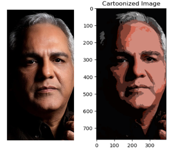
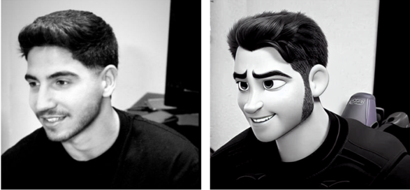
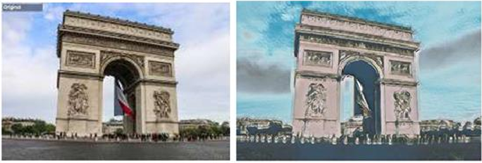
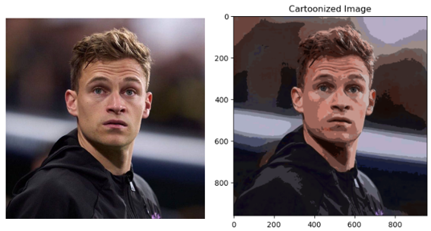
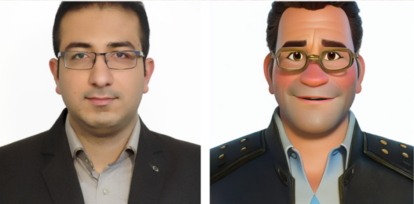
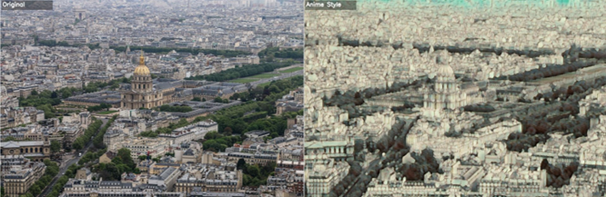

# Convert Real Images into Cartoon Shapes — Three Approaches

With the rapid growth of the cartoon film industry, technologies like compression, style transfer, and real-character adaptation are becoming essential.  
Cartoon images are defined by uniform colors, distinct lines, and smooth backgrounds — making them visually unique compared to natural images.  
One of the key challenges in this field is generating cartoon characters that retain human identity while embracing artistic abstraction.

---

## Project Overview

This project explores three distinct approaches to cartoonize real images:

### 1⃣ Traditional Image Processing  
Using classical computer vision techniques such as:
- Edge detection (e.g., Canny)
- Color clustering (e.g., K-means)
- Stylized filters and smoothing

This method is lightweight and fast, ideal for simple cartoon effects.

---

### 2⃣ Stable Diffusion + Prompt Engineering  
Leveraging generative AI models guided by text prompts to produce stylized cartoon versions of input images.  
We used prompt tuning to achieve:
- Disney-style characters
- Fantasy backgrounds
- Expressive facial features

Tools: [Stable Diffusion WebUI](https://github.com/AUTOMATIC1111/stable-diffusion-webui)

---

### 3⃣ AnimeGANv2 (Hayao Style)  
Training a GAN to replicate the iconic style of  Hayao Miyazaki’s anime .

Features:
- Edge smoothing preprocessing
- Spectral normalization for stability
- Multi-loss optimization (content, color, gram, adversarial)

Training was done on:
- dataset/Hayao: anime frames
- dataset/train_photo: real-world photos

---

## 🧪 Technologies Used

- Python 3.10  
- PyTorch 2.1.0 + CUDA 11.8  
- OpenCV  
- Stable Diffusion  
- AnimeGANv2  
- Prompt Engineering

---

## :camera: Sample Results

| Traditional | Disney | Anime |
|-------------|--------|-------|
|  |  |  |
|  |  |  |
---

## :rocket: How to Run AnimeGAN Training

```bash
python3 train.py \
  --anime_image_dir dataset/Hayao \
  --real_image_dir dataset/train_photo \
  --model v2 \
  --batch_size 8 \
  --amp \
  --epochs 70 \
  --gan_loss lsgan \
  --lr_g 2e-5 \
  --lr_d 4e-5 \
  --wadvd 300.0 \
  --wadvg 300.0 \
  --wcon 1.5 \
  --wgra 3.0 \
  --wcol 30.0 \
  --use_sn
